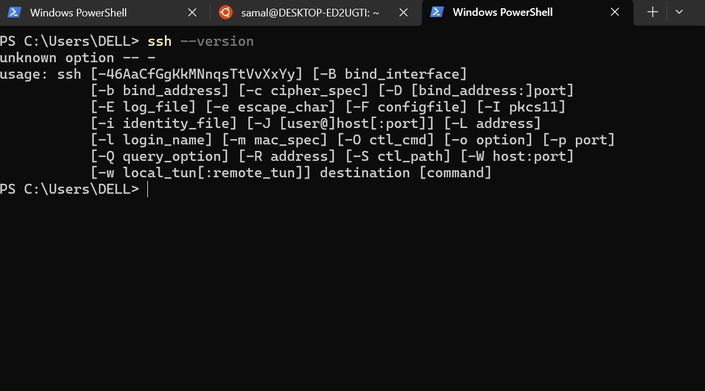

# SYSTEM INSTALLATION LAB GUIDE
## ESSENTIAL TOOLS FOR SEAMLESS INTEGRATION: 

- SSH (Secure Shell)
- Ssh-Agent
- Markdown Format
- Visual Studio Code (VSCode)

1. OPENSSH (AND SSH-AGENT) INSTALLATION AND KEY PAIR SETUP

   Install SSH/OpenSSH (Windows) and  verify if its properly installed. Generate ssh keys to be aadded to the git hub account.

   
- open ssh was properly installed as shown in the image bellow

   

- ssh keys have been generated 
    

- I have copied the ssh public key also added to the github account 

 

- The connection is confirmed 

 

- This images below shows i have installed visual studio code on my machine also installed the required extension

 

